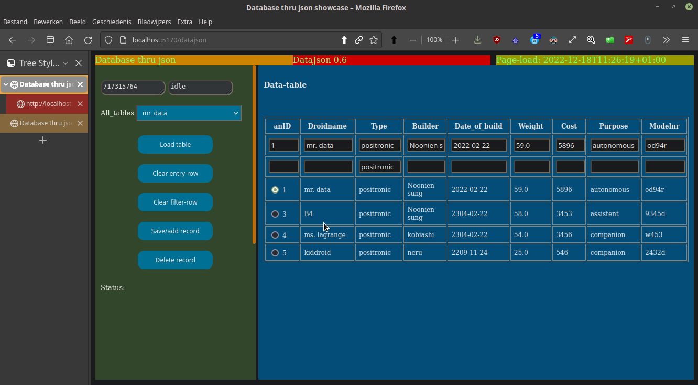

## Json2web - Web-element-generator and database-app

[For the newbies there is a set of videos that nicely explain nim, jester (and moustachu) and got me up and running..](https://www.youtube.com/watch?v=zSXbifhuZSo&t=600s)

### Introduction
Json2web started originally as a set of nim-modules plus their implementation to  make it easy to create web-controls, like checkboxes. Based on the principle of separation of concerns, the idea is to create a separate gui-definition, from which the gui is generated by specialized procedures.  In Readibl I used nim-constructs for the definition, but that was cumbersome. The project has turned into some subprojects of increasing complexity to showcase those  posibilities. The latest subproject is Datajson, which is a generalized database-form (based on Sqlite). The project exposes different options to do things that may or may not be usefull in different situations.

### Json as gui-definition
The method to do this is that you start with a json-file in which you create the definition of the needed controls or web-elements, based on a template-json-file. In this template-definition all the possible controls are written, which you can alter or copy to accomodate you gui.

The json-file-technique is usable for databases, because a module can write data from the database to the json-definition-file (g_db2json.nim). In a following pass a html-table-element can be generated from the json-def (in g_html_json.nim). 

There is a slight performance-penalty for using the json-intermediate stage (in stead of writing directly from database to html-code) but that seems  small in comparison to the slowness of (a larger) database and the rendering of a html-table in the browser.

### Subprojects and file-naming
As said, Json2web showcases some subprojects in increasing difficulty and capabilities. This matches my own learning experience and curve. Not being an computer-science-academic I try options to make things work easily, which I lateron may substitute for better methods. I am inclined to keep the none-used options thoe, as sort of none-used junk-dna ;-)

This repo makes use of generic files (g_somemodule.nim) and project-specific files (projectprefix_somefunction.nim). The generic files are used in all the projects. Currently available projects (prefixes) are hello, controls and scricon (scripted controls) and datajson; so for example you have controls_startup.nim to start the controls-project. Nimwebbie was a futurally planned project to create a web-gui-builder, but now I regard that project of lower priority.

Common components that are used are jester, moustachu (substitution-engine) and json.

### The subprojects further looked at

Further code-review is forth-coming and will be presented in the wiki.

#### Hello
The hello-project is allways usefull to show a minimal project, thereby showing the minimal structure needed, on which further functions can be built.

#### Controls
This project shows the generation of some elaborate controls: select-element/combobox, checkbox and radiobox. A simple element like a button or texarea can be entered in project_inner.html directly; its simpleness and staticness makes it unnecessary to generate.  

#### Scricon (scripted controls)
While Controls was a pure server-side approach, in Scricon javascript is used. Scricon is showing:
- how javascript is used in basic examples, especially event-code.
- how server-code can be run from javascript thru a technique i call the cookie-tunnel.
Scricon does not show:
- advanced javascript-functions, like:
	- setting a select from javascript. (the cookie-tunnel makes that a lower priority).
	- setting other controls or elements from javascript.

#### Datajson
The latest subproject is Datajson, which is a generalized database-form (based on Sqlite). To repeat: The json-file-technique is usable for databases, because a module can write data from the database to the json-definition-file (g_db2json.nim). In a following pass a html-table-element can be generated from the json-def (in g_html_json.nim). 

The technique to run specific code is based on a textarea-element "curaction" in which the current action is set on basis of an event, like a button-click, and a submit is done. In the relevant route happens something like: if curaction == "save.." then save the record.

### Start your own project
- install the components thru nimble:
	- Jester; the web-server
	- Moustachu; a substitution-engine
- Copy the latest project, currently datajson, by cloning or by downloading a release (forth-coming), containing files of the form:
	- g_somegenericmodule.nim
	- project_somefunction.nim
	- project.db
	- project_inner.html
	- project_outer.html
	- project_gui.json
	- /public/css-sheet
	- /public/javascriptfile
	- /stored_gui_nodes/      use dir only when persistOnDisk is chosen
- substitute your own projectname for the project (currently datajson) both in the filenames and for constants and variables in the modules themselves.
- look in the latest or earlier subprojects if you need info on certain functionalities.

Version 0.2
